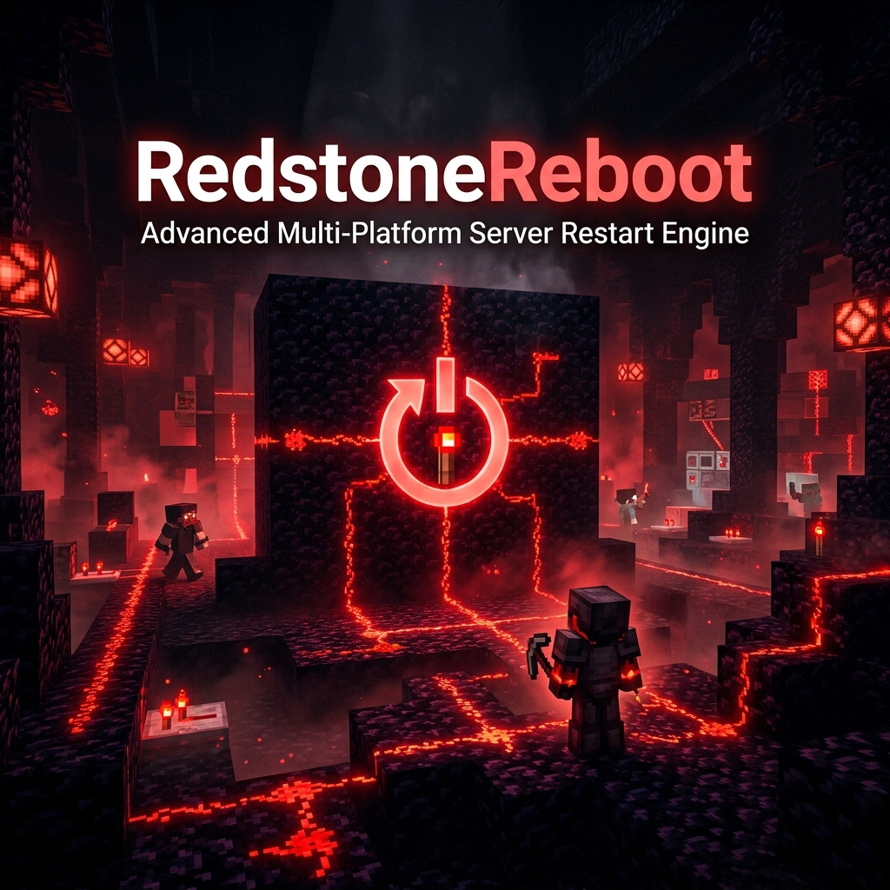
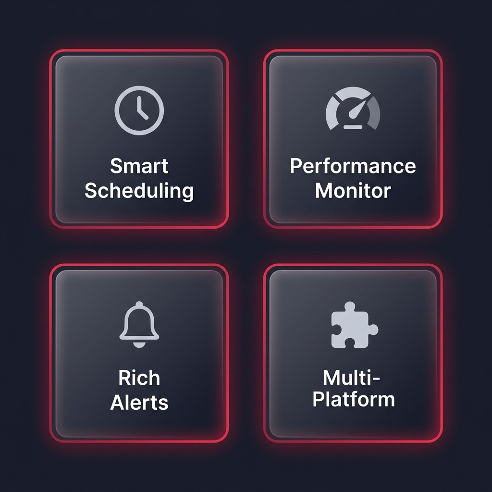

<div align="center">



<br/>

# ⚡ RedstoneReboot

**The Most Advanced Multi-Platform Minecraft Server Restart Engine**

[](https://github.com/DemonZDevelopment/RedstoneReboot/releases)
[](https://github.com/DemonZDevelopment/RedstoneReboot/actions)
[](LICENSE)
[](https://adoptium.net)
[](https://minecraft.net)

<br/>

**Bukkit** · **Paper** · **Spigot** · **Folia** · **Fabric** · **Forge** · **NeoForge**

[📖 Wiki](docs/wiki/Home.md) · [⬇️ Download](https://github.com/DemonZDevelopment/RedstoneReboot/releases) · [🛠️ Developer API](docs/api/README.md) · [🐛 Issues](https://github.com/DemonZDevelopment/RedstoneReboot/issues) · [💬 Discord](https://discord.gg/demonz)

</div>

---

<div align="center">

</div>

## 🔥 Why RedstoneReboot?

RedstoneReboot isn't just a restart plugin — it's a **professional-grade server lifecycle engine** built for production environments. From single-server setups to massive networks, it delivers reliability, intelligence, and elegance.

<table>
<tr>
<td width="50%">

### 🕐 Intelligent Scheduling
- Multiple daily restart windows with precise timing
- **Global timezone support** (Asia/Kolkata, UTC, America/New_York, etc.)
- Day-specific scheduling (weekdays, weekends, custom)
- Configurable countdown warnings at every interval

</td>
<td width="50%">

### 📊 Real-Time Performance Monitor
- Live **TPS tracking** with automatic restart triggers
- **Memory usage monitoring** to prevent leaks & crashes
- Consecutive-check thresholds to avoid false positives
- Emergency restart system for critical server states

</td>
</tr>
<tr>
<td>

### 🔔 Rich Multi-Channel Alerts
- **Chat**, **Title**, **Action Bar**, and **Sound** alerts
- Fully customizable formatting with color code support
- Permission-based notification filtering
- Emergency alerts with distinct styling and priority

</td>
<td>

### 🧩 Multi-Platform Architecture
- **Bukkit/Spigot/Paper**: Full support, 1.9 → 1.21.1
- **Folia**: Async region-threaded scheduler support
- **Fabric / Forge / NeoForge**: Server-side mod support
- Cross-version adapter with intelligent reflection fallbacks

</td>
</tr>
</table>

---

## 🚀 Quick Start

### 📋 Requirements
| Platform | Minimum Version | Java Version |
|----------|----------------|-------------|
| Paper/Spigot | 1.9+ | Java 8+ (1.9-1.16), Java 17+ (1.17+) |
| Folia | 1.20+ | Java 17+ |
| Fabric | 1.20.4+ | Java 17+ |
| Forge | 1.20.4+ | Java 17+ |
| NeoForge | 1.20.4+ | Java 17+ |

### ⬇️ Installation

**Bukkit / Spigot / Paper / Folia:**
1. Download `RedstoneReboot-Bukkit-x.x.x.jar` from [Releases](https://github.com/DemonZDevelopment/RedstoneReboot/releases)
2. Place in your server's `plugins/` folder
3. Start the server — config files auto-generate
4. Edit `plugins/RedstoneReboot/config.yml` to your needs
5. Reload with `/reboot reload` or restart the server

**Fabric / Forge / NeoForge:**
1. Download the appropriate mod jar from [Releases](https://github.com/DemonZDevelopment/RedstoneReboot/releases)
2. Place in your server's `mods/` folder
3. Start the server — config auto-generates in `config/redstonereboot/`

---

## ⚙️ Configuration

```yaml
# RedstoneReboot v1.0.0 — Core Configuration
scheduled-restarts:
  enabled: true
  timezone: "Asia/Kolkata"
  times:
    - "00:00"   # Midnight
    - "06:00"   # Morning
    - "12:00"   # Noon
    - "18:00"   # Evening
  days:
    - "ALL"     # Every day (or MONDAY, TUESDAY, etc.)

monitoring:
  enabled: true
  tps-threshold: 18.0
  memory-threshold: 85.0
  consecutive-checks: 3
  check-interval: 30

emergency:
  enabled: true
  tps-threshold: 12.0
  memory-threshold: 95.0
  delay: 30
```

> 📖 See the [full configuration reference](docs/wiki/Configuration.md) for all options.

---

## 🎮 Commands & Permissions

| Command | Description | Permission |
|---------|-------------|-----------|
| `/reboot` | Show plugin status & help | `redstonereboot.use` |
| `/reboot now [delay]` | Restart immediately (default 60s) | `redstonereboot.restart.now` |
| `/reboot schedule <seconds>` | Schedule a future restart | `redstonereboot.restart.schedule` |
| `/reboot cancel` | Cancel a pending restart | `redstonereboot.restart.cancel` |
| `/reboot status` | Detailed server & restart status | `redstonereboot.status` |
| `/reboot info` | Server performance details | `redstonereboot.status` |
| `/reboot reload` | Hot-reload configuration | `redstonereboot.config.reload` |

| Permission Node | Description | Default |
|-----------------|-------------|---------|
| `redstonereboot.*` | All permissions | OP |
| `redstonereboot.admin` | Admin access | OP |
| `redstonereboot.use` | Basic usage | Everyone |
| `redstonereboot.notify` | Receive restart notifications | Everyone |

---

## 📊 PlaceholderAPI

Seamlessly integrates with **PlaceholderAPI** for MOTDs, scoreboards, tab lists, and more.

| Placeholder | Example Output | Use Case |
|-------------|----------------|----------|
| `%redstonereboot_next_restart%` | `2025-12-25 18:00:00 IST` | MOTD, Info displays |
| `%redstonereboot_time_until%` | `2h 30m` | Scoreboards, Tab lists |
| `%redstonereboot_tps%` | `19.8` | Performance monitors |
| `%redstonereboot_memory%` | `67.3%` | Status dashboards |
| `%redstonereboot_status%` | `Normal operation` | Status indicators |

---

## 🛠️ Developer API

RedstoneReboot provides a rich API for developers to integrate with.

```java
// Get the RedstoneReboot API
RedstoneRebootPlugin plugin = (RedstoneRebootPlugin) Bukkit.getPluginManager()
    .getPlugin("RedstoneReboot");

// Schedule a custom restart
plugin.getRestartManager().scheduleRestart(300, RestartReason.API, "MyPlugin");

// Monitor performance
double tps = plugin.getServerLoadMonitor().getLastTPS();
boolean healthy = plugin.getServerLoadMonitor().isHealthy();

// Listen for restart events
@EventHandler
public void onRestart(RestartEvent event) {
    if (event.getReason() == RestartReason.EMERGENCY_TPS) {
        // Handle emergency before it fires
    }
}
```

> 📖 Full developer documentation: [Developer API Guide](docs/api/README.md)

---

## 🏗️ Building from Source

```bash
git clone https://github.com/DemonZDevelopment/RedstoneReboot.git
cd RedstoneReboot
./gradlew build
```

Artifacts are output to:
- `bukkit/build/libs/RedstoneReboot-Bukkit-*.jar`
- `folia/build/libs/RedstoneReboot-Folia-*.jar`
- `fabric/build/libs/RedstoneReboot-Fabric-*.jar`
- `forge/build/libs/RedstoneReboot-Forge-*.jar`
- `neoforge/build/libs/RedstoneReboot-NeoForge-*.jar`

---

## 🤝 Contributing

We welcome contributions! Please see our [Contributing Guide](CONTRIBUTING.md) for details.

1. **Fork** the repository
2. **Create** your feature branch (`git checkout -b feature/amazing-feature`)
3. **Commit** your changes (`git commit -m 'feat: add amazing feature'`)
4. **Push** to the branch (`git push origin feature/amazing-feature`)
5. **Open** a Pull Request

---

## 📞 Support & Community

- 📖 [**Complete Wiki**](docs/wiki/Home.md)
- 🛠️ [**Developer API Docs**](docs/api/README.md)
- 🐛 [**Bug Reports & Feature Requests**](https://github.com/DemonZDevelopment/RedstoneReboot/issues)
- 💬 [**Community Discussions**](https://github.com/DemonZDevelopment/RedstoneReboot/discussions)
- 🔗 [**DemonZ Development**](https://demonzdevelopment.online)

---

## 📄 License

This project is licensed under the **MIT License** — see the [LICENSE](LICENSE) file for details.

---

<div align="center">

**Crafted with ❤️ by [DemonZ Development](https://demonzdevelopment.online)**

*Production-grade Minecraft infrastructure for the modern era.*

[](https://github.com/DemonZDevelopment)
[](https://demonzdevelopment.online)

</div>
