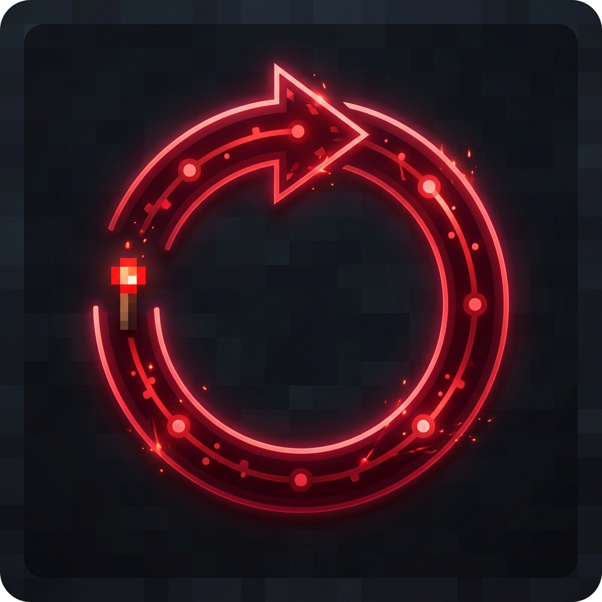

# 📖 RedstoneReboot Wiki

<div align="center">


**Complete documentation for RedstoneReboot — The Advanced Multi-Platform Server Restart Engine**
</div>

---

## 📚 Table of Contents

### Getting Started
- [🏠 Home](Home.md) — Overview & quick links
- [📥 Installation](Installation.md) — Platform-specific installation guides
- [⚙️ Configuration](Configuration.md) — Complete config.yml reference

### Features
- [🕐 Scheduled Restarts](Scheduled-Restarts.md) — Setting up automatic restarts
- [📊 Performance Monitoring](Performance-Monitoring.md) — TPS & memory monitoring
- [🔔 Alert System](Alert-System.md) — Configuring notifications
- [🚨 Emergency Restarts](Emergency-Restarts.md) — Critical condition handling

### Integrations
- [🔗 PlaceholderAPI](PlaceholderAPI.md) — Placeholder reference
- [🔐 LuckPerms](LuckPerms.md) — Permission integration
- [🧩 Multi-Platform](Multi-Platform.md) — Bukkit, Folia, Fabric, Forge, NeoForge

### For Developers
- [🛠️ Developer API](../../docs/api/README.md) — API reference & examples
- [📦 Events](Events.md) — Custom event reference
- [🤝 Contributing](../../CONTRIBUTING.md) — How to contribute

---

## 🏠 Overview

**RedstoneReboot** is a production-grade server restart management system supporting every major Minecraft server platform. It provides intelligent scheduling, real-time performance monitoring, multi-channel alerts, and a comprehensive developer API.

### Key Capabilities

| Feature | Description |
|---------|------------|
| **Smart Scheduling** | Multiple daily restarts with timezone & day-of-week support |
| **Performance Monitor** | TPS + Memory tracking with automatic restart triggers |
| **Emergency System** | Instant restart on critical server conditions |
| **Alert Engine** | Chat, Title, ActionBar, Sound — fully customizable |
| **Multi-Platform** | Bukkit, Spigot, Paper, Folia, Fabric, Forge, NeoForge |
| **Developer API** | Events, hooks, and programmatic restart control |
| **PlaceholderAPI** | 10+ placeholders for scoreboards, MOTDs, tab lists |
| **LuckPerms** | Deep integration via reflection (no hard dependency) |

### Supported Versions

```
Bukkit/Spigot/Paper:  1.9  → 1.21.1
Folia:                1.20 → 1.21.1
Fabric:               1.20.4+
Forge:                1.20.4+
NeoForge:             1.20.4+
```

---

## 🆘 Getting Help

- **Bug Reports**: [GitHub Issues](https://github.com/sdemonzdevelopment-spec/RedstoneReboot/issues/new?template=bug_report.yml)
- **Feature Requests**: [GitHub Issues](https://github.com/sdemonzdevelopment-spec/RedstoneReboot/issues/new?template=feature_request.yml)
- **Discussions**: [GitHub Discussions](https://github.com/sdemonzdevelopment-spec/RedstoneReboot/discussions)
- **Discord**: [DemonZ Discord](https://discord.gg/demonz)
